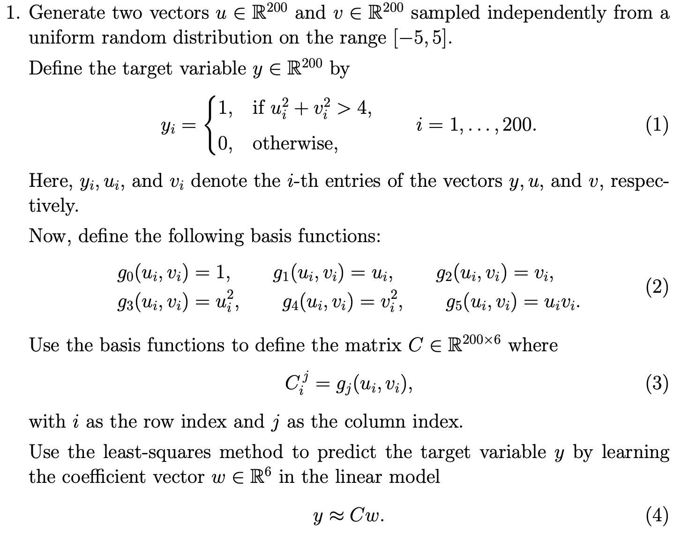
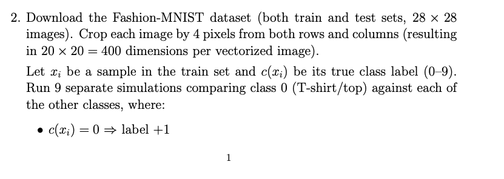
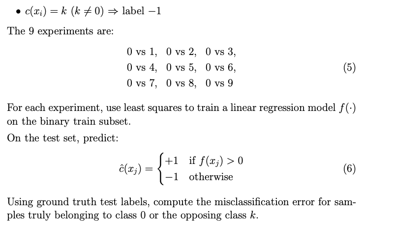
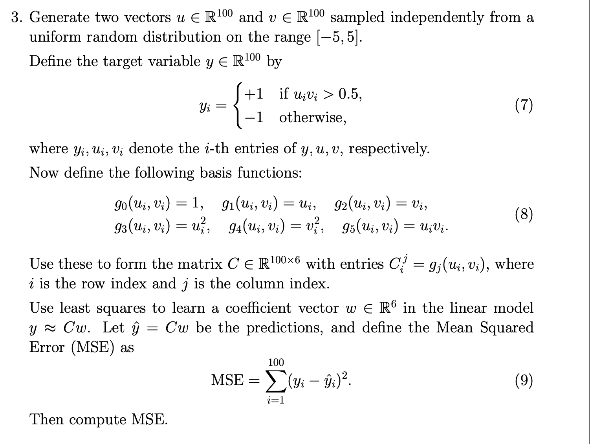
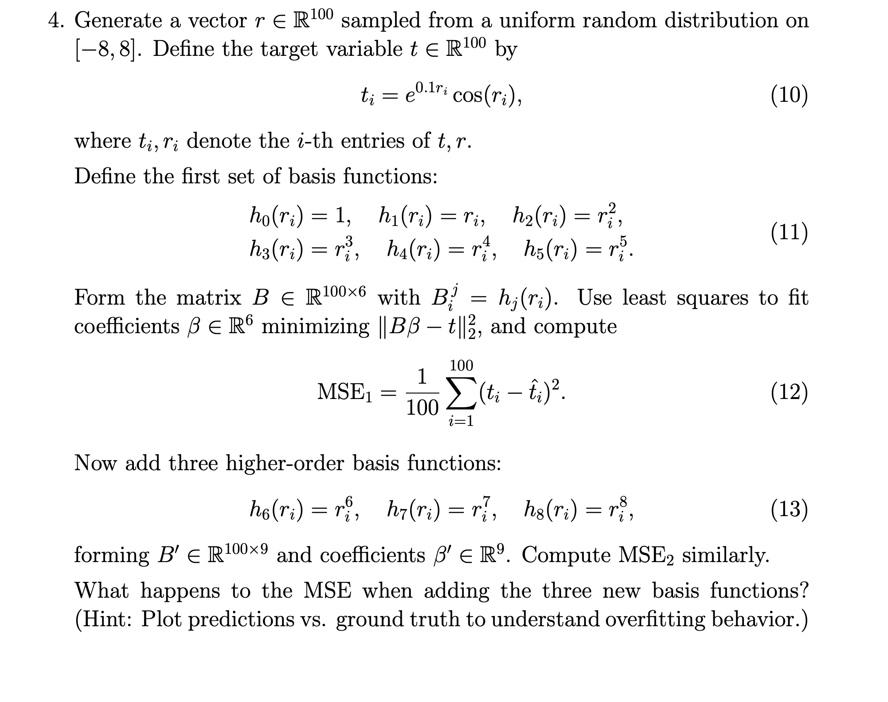
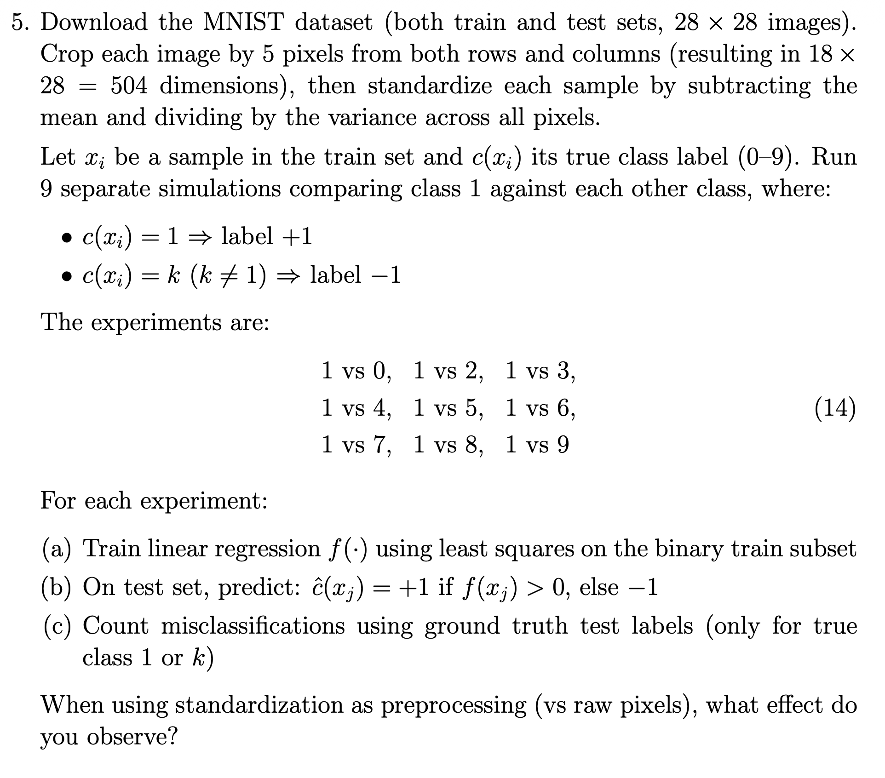

 _Disclaimer: This solution to assignments is made (typed & thought upon) completely by hand and with full understanding of the content by me_ <br/>
\begin{flushright}
\textit{-- Shubham Krishan, 24MA10063}
\end{flushright}
<br/>

> _Constraints: Using only `numpy` for calculations and `matplotlib` for visualizations_

# Question 1:



## Initializing $u, v \in \mathbb{R}^{200}$

```{python}
import numpy as np
import matplotlib.pyplot as plt
import seaborn as sns

u = np.random.uniform(-5, 5, 200)
v = np.random.uniform(-5, 5, 200)
```

Now, the target variable $y \in \mathbb{R}^{200}$ as defined:

```{python}
y = np.where(u**2 + v**2 > 4, 1, 0)
```

Given basis functions:
$g_0(u_i, v_i) = 1$, $g_1(u_i, v_i) = u_i$, $g_2(u_i, v_i) = v_i$, $g_3(u_i, v_i) = {u_i}^{2}$, $g_4(u_i, v_i) = {v_i}^{2}$, $g_5(u_i, v_i) = v_iu_i$

```{python}
def g1(ui, vi):
    return 1

def g2(ui, vi):
    return ui

def g3(ui, vi):
    return vi

def g4(ui, vi):
    return ui**2

def g5(ui, vi):
    return vi**2

def g6(ui, vi):
    return ui*vi

basis_func = {
    0: g1,
    1: g2,
    2: g3,
    3: g4,
    4: g5,
    5: g6
}

```

## Defining matrix $C \in \mathbb{R}^{200 \times 6}$

```{python}
c = np.zeros((200, 6))

for i in range(200):
    for j in range(6):
        c[i][j] = basis_func.get(j, lambda u,v: None)(u[i], v[i])
```

## Training for $\tilde{y}$:

the model for this problem is: 

$\tilde{y}(u, v) = \sum_{i=0}^{5} w_ig_i(u,v)$ = $w_0 + w_1u + w_2v + w_3u^2 + w_4v^2 + w_5uv$

That is, $\mathbf{y} = C\mathbf{w}$

to use least squares method, define: $E(\mathbf{w}) = \frac{1}{2}\sum_{i=1}^{200}(y_i - \tilde{y}_i)^2$

Now, our main goal is to minimize $E(\mathbf{w})$.

to get $\tilde{w}$ we solve the least squares problem $\min_{w} \lVert \mathbf{y}-C\mathbf{w} \rVert^2$

<!-- We can solve the normal equation $\mathbb{C}^{T}C\mathbf{w} = \mathbb{C}^{T}y$ for getting the ideal weights $\tilde{w}$ on the randomly generated C matrix.  -->

<!-- So, we have $\tilde{w} = (\mathbb{C}^{T}C)^{-1}\mathbb{C}^{T}y$ -->

```{python}
w = np.linalg.lstsq(c, y, rcond=None)[0]

print("Weights: ")
for i, val in enumerate(w):
    print(i+1, val)
```

## Final views on the problem

The target set and basis functions used here trained the model $\tilde{y}$ to predict whether a point (u, v) lies outside the circle of radius '2' or not (defined by the target condition: $u^2 + v^2 > 4$). So, now we should be able to predict this using the approximated weights $\tilde{w}$.

### Visualization: True Boundary vs. Predicted model

```{python}
# helper function for predictions
def pred(u, v, w):
    features = np.array([1,u,v,u**2,v**2,u*v])
    y_hat = features @ w # dot product of given surface with w
    return y_hat

threshold = np.mean(y)


# create a grid for visualization
grid_size = 200
u_grid = np.linspace(-5, 5, grid_size)
v_grid = np.linspace(-5, 5, grid_size)
U, V = np.meshgrid(u_grid, v_grid)


# compute predictions over grid
Z = np.zeros_like(U)

for i in range(grid_size):
    for j in range(grid_size):
        Z[i, j] = pred(U[i, j], V[i, j], w)

# decision boundary using threshold (chosen arbitrarily as the mean)
Z_class = (Z > threshold).astype(int)

plt.figure()

# plot decision regions
plt.contourf(U, V, Z_class, alpha=0.3, levels=[-0.1, 0.5, 1.1])
plt.scatter(u, v, c=y, cmap='bwr', edgecolors='k', label="training data")

# plot true boundary (circle of radius 2)
theta = np.linspace(0, 2*np.pi, 200)
plt.plot(2*np.cos(theta), 2*np.sin(theta), 'k--', label="true boundary")

plt.xlabel("u")
plt.ylabel("v")
plt.legend()
plt.title("Decision Boundary vs Ground Truth")

plt.show()
```


Inference to this image : ....

### Testing
```{python}
TEST_SIZE = 100
MAX_PRINT = 10
u_test = np.random.uniform(-5, 5, TEST_SIZE)
v_test = np.random.uniform(-5, 5, TEST_SIZE)
print("TESTING on random uniform test with size: ", TEST_SIZE )

correct = 0

for i in range(TEST_SIZE):
    y_hat = pred(u_test[i], v_test[i], w)
    prediction = 1 if y_hat > threshold else 0
    t = 1 if u_test[i]**2 + v_test[i]**2 > 4 else 0

    if prediction == t:
        correct += 1
    if i < MAX_PRINT:
        print(f"({u_test[i]:.2f}, {v_test[i]:.2f}) => model: {prediction} truth: {t}")
    elif i == MAX_PRINT:
        print("...")

print(f"points outside the circle in training data: {threshold}%") # shows skewness in the random training dataset
print(f"accuracy: {(correct/TEST_SIZE)*100}%")

```

_Note: Since the dataset is not balanced (i.e., the proportion of class 1 labels is significantly higher than that of class 0), a threshold of 0.5 is not appropriate. As the model is obtained via least-squares regression and produces continuous outputs, a decision threshold is required for classification. In this case, we use the empirical mean of the training labels as the threshold to account for the class imbalance._

# Question 2:




## Setting up MNIST dataset

> using keras datasets for clean mnist import to avoid messy mnist_reader util files (alternative way was to use zalando's mnist_reader util)
```{python}
from tensorflow.keras.datasets import fashion_mnist
(x_train, y_train), (x_test, y_test) = fashion_mnist.load_data()
```

To reduce dimensionality and remove irrelevant border pixels, we crop image from $28 \times 28$ to $20 \times 20$:
```{python}
x_train = x_train[:, 4:24, 4:24]
x_test = x_test[:, 4:24, 4:24]
```

Each image is flattened into a feature vector:
```{python}
x_train = x_train.reshape(len(x_train), -1)
x_test = x_test.reshape(len(x_test), -1)

# normalize pixel values to [0,1] to improve numerical stability of least squares
x_train = x_train / 255.0 
x_test = x_test / 255.0
```

## Setting up the Model

First, we define a helper function to _extract only the relevant classes (0 and k) and relabel them_:
```{python}
# Helper function to filter out x, y sets into two label classes 0 and k
def get_binary(x ,y, k):
    mask = (y==0) | (y==k)
    x_bin = x[mask]
    y_bin = y[mask]

    y_bin = np.where(y_bin == 0, 1, -1);

    return x_bin, y_bin

```


## Model: Least Square Classifier

We model the prediction as: $\tilde{y}=\mathbf{w}^T\mathbf{x} + b$ , where $b$ is the bias term.

To incorporate the bias term, we augment the feature matrix with a column of ones. The opimal weight $\tilde{w}$ are obtained by solving the equation:

$\min_{\mathbf{w}}|X\mathbf{w}-y|^2$

Using the Moore-Penrose pseudoinverse (built-in in numpy):
```{python}
def train_ls(X, y):
    X = np.c_[np.ones(X.shape[0]), X]  # add bias
    w = np.linalg.pinv(X) @ y # best fit line using pseudoinverse
    return w
```

### Prediciton Rule:

Predictions are made using the sign of the model output:
```{python}
def predict(X, w):
    X = np.c_[np.ones(X.shape[0]), X]
    return np.where(X @ w > 0, 1, -1)
```

### Evaluation Metric:

We use the misclassification error defined as:
$\text{Error} = \frac{1}{N}\sum_{i=1}^{N}\mathbb{1}(y_i\neq\hat{y}_i)$
```{python}
def misclassification_error(y_true, y_pred):
    return np.mean(y_true != y_pred)
```

### Running Experiments

Training and evaluating the model for each $k \in {1,\dots, 9}$:
```{python}
results = {}

for k in range(1, 10):
    X_train_k, y_train_k = get_binary(x_train, y_train, k)
    w = train_ls(X_train_k, y_train_k)
    X_test_k, y_test_k = get_binary(x_test, y_test, k)
    y_pred = predict(X_test_k, w)
    error = misclassification_error(y_test_k, y_pred)
    
    results[k] = error
    print(f"0 vs {k} => error: {error:.4f}")
```


## Interepretation and Inference

### Visualization

```{python}
# convert results to lists
ks = list(results.keys())
errors = list(results.values())

plt.figure()

# bar plot
sns.barplot(x=ks, y=errors)

# optional: overlay line for trend
plt.plot(ks, errors, marker='o')

plt.xlabel("Class k (0 vs k)")
plt.ylabel("Misclassification Error")
plt.title("Least Squares Classifier Performance on Fashion-MNIST")

plt.show()
```

This experiment highlights how well a linear model trained via least squares can separate different classes in a high-dimensional image space.

Key observations:

- Since the model is linear, performance depends on how linearly separable the classes are.
- Some class pairs (e.g., visually distinct clothing types) are expected to yield lower error.
- Others with similar shapes or textures may result in higher misclassification.

Despite its simplicity, this approach provides a useful baseline before moving to more expressive models like logistic regression or neural networks.

# Question 3:



## Process

Our goal is to find MSE for the target variable $y\in\mathbb{R}^{100}$ given by:

$y_i = \begin{cases}+1 & \text{if} u_iv_i>0.5\\ -1 & \text{otherwise}\end{cases}$

i.e. a prediction model to show if a point (u,v) $\in$ {set of points outside hyprbola $\text{uv} = 0.5$ for $u\in\mathbf{u}, v\in\mathbf{v}$}

The dataset for training is _random points sampled independently from the uniform distribution_ of points in a square of side length 5.

### Defining the Training Dataset

```{python}
Q3_SAMPLE_SIZE = 100
u = np.random.uniform(-5, 5, Q3_SAMPLE_SIZE)
v = np.random.uniform(-5, 5, Q3_SAMPLE_SIZE)
```

and the target variable $\mathbf{y}$ is:

```{python}
y = np.where(u*v > 0.5, 1, -1)
```

### Building the $\mathbb{C}$ matrix with given basis functions;

```{python}
c = np.zeros((Q3_SAMPLE_SIZE, 6))

# using the basis function dictionary defined in Q1
for i in range(Q3_SAMPLE_SIZE):
    for j in range(6):
        c[i][j] = basis_func.get(j, lambda u,v: None)(u[i], v[i])
```

### Solving for the optimal weights

The optimal weights $\mathbf{w}$ such that $\mathbb{C}\mathbf{w} \approx \mathbf{y}$ is calculated as:

```{python}
w = np.linalg.lstsq(c, y, rcond=None)[0]

print("weights: ")
for i, val in enumerate(w):
    print(f"{i} => {val}")
```

### Calculating MSE

Here, we have $\hat{y}=\mathbb{C}\mathbf{w}$ and MSE is given by:

$\text{MSE } = \sum_{i=1}^{100}(y_i - \hat{y}_i)^2$

```{python}
y_hat = c @ w
mse = np.sum((y-y_hat)**2)

print(f"mse = {mse:.5f}, mean: {np.mean((y-y_hat)**2)}")
```


## Inference and Observations

* The model approximates a nonlinear boundary $(uv = 0.5)$ using linear least squares with basis functions.
* Performance depends on whether the basis includes interaction terms (e.g., $\mathbf{uv}$).
* A lower MSE indicates better approximation of the nonlinear relationship.
* This is effectively a regression-based classification, where predictions are thresholded.


# Question 4:



## Setting up 

Making the dataset:
```{python}
r = np.random.uniform(-8,8,100)

t = np.exp(0.1*r) * np.cos(r)

B1 = np.vander(r, 6, increasing=True)

beta1 = np.linalg.lstsq(B1, t)[0]

t_hat1 = B1 @ beta1

mse1 = np.mean((t-t_hat1)**2)

print(f"mse: {mse1}")

B2 = np.vander(r, 9, increasing=True)

beta2 = np.linalg.lstsq(B2, t)[0]

t_hat2 = B2 @ beta2

mse2 = np.mean((t-t_hat2)**2)

print(f"mse2: {mse2}")
```


### Visualization: Truth vs. Predictions


For Ground truth: taking evenly spread numbers for getting the actual function

Predictions: using the order 6 and 8 models to plot separate graphs.
```{python}
r_plot = np.linspace(-8, 8, 100)
t_true = np.exp(0.1 * r_plot) * np.cos(r_plot)

# plot predictions
B1_plot = np.vander(r_plot, 6, increasing=True)
t_pred1 = B1_plot @ beta1

B2_plot = np.vander(r_plot, 9, increasing=True)
t_pred2 = B2_plot @ beta2

# plot
plt.figure()

plt.scatter(r, t, label="data (ground truth samples)", alpha=0.5)
plt.plot(r_plot, t_true, label="true function", linewidth=2)
plt.plot(r_plot, t_pred1, label="degree 5 fit")
plt.plot(r_plot, t_pred2, label="degree 8 fit")

plt.legend()
plt.title("Polynomial Regression: Predictions vs Ground Truth")
plt.show()
```


# Question 5:



## Setting up MNIST

Setting up and finding the result:
```{python}
from tensorflow.keras.datasets import mnist
(x_train, y_train), (x_test, y_test) = mnist.load_data()


# reducing dimensions
x_test = x_test[:, 5:23, 5:23]
x_train = x_train[:, 5:23, 5:23]

# flattening

x_train = x_train.reshape(len(x_train), -1)
x_test = x_test.reshape(len(x_test), -1)

# standardization
print(f"samples: {x_train.shape[0]}, features: {x_train.shape[1]}")
# print(x_train[0])
mean = x_train.mean(axis=0)
# print("mean: ", mean)
# sqsum = np.zeroes(x_train.shape[1])
# variance = np.zeros(x_train.shape[1])
# for i in range(x_train.shape[0]):
#    variance += (x_train[i] - mean)**2

# variance /= x_train.shape[0]

# print("varaince: ", variance.shape)

std_deviation = x_train.std(axis=0)

# print("std: ", std_deviation)

# finally, 
x_train = (x_train - mean) / std_deviation
# print("standardized: ", x_train[0])
# print(x_train.mean(axis=0))   # should be ~0
# print(x_train.std(axis=0))    # should be ~1

# Helper function to filter out x, y sets into two label classes 0 and k
def get_binary(x ,y, k):
    mask = (y==0) | (y==k)
    x_bin = x[mask]
    y_bin = y[mask]

    y_bin = np.where(y_bin == 0, 1, -1);

    return x_bin, y_bin

def train_ls(x, y):
    x = np.c_[np.ones(x.shape[0]), x]
    return np.linalg.pinv(x) @ y

def predict(x, w):
    x = np.c_[np.ones(x.shape[0]), x]
    return np.where(x@w > 0, 1, -1)

def misclassification_error2(y_true, y_pred):
    return np.mean(y_true != y_pred)
for k in range(1, 10):
    x_train_k, y_train_k = get_binary(x_train, y_train, k)
    x_test_k, y_test_k = get_binary(x_test, y_test, k)
    w = train_ls(x_train_k, y_train_k)
    y_pred = predict(x_test_k, w)
    # print(y_pred)
    error = misclassification_error2(y_test_k, y_pred)
    results[k] = error

meanout = np.array(list(results.values()))
meanout = meanout.mean()

# print(results)
print(f"Mean misclassification error:  {meanout:.3f}")

# visualization
ks = list(results.keys())
errors = list(results.values())

plt.figure()

sns.barplot(x=ks, y=errors, color='skyblue', alpha=0.6)

## trend plot
plt.plot(ks, errors, marker='o')


plt.xlabel("Class k (0 vs. k)")
plt.ylabel("Misclassification Error")
plt.title("Misclassification Plot")

plt.show()


# print("weights: ", w)

    

```

# New Things Learned:
@TODO: Q1 visual inference explanation and views update krlo
@TODO: Q4 context and explanation likhna hai (code done)

Python code:
<br/>

- `np.linalg.lstsq(A, b, rcond=None)` => solves the matrix linear equation directly: $A\mathbf{x} = b$
-  `np.where(<condition>, <val_T>, <val_F>)` => allowed me to construct np vectors directly using conditions

Inference of problems:

> Question 1:

- understood the differences in applications between regression and classification models
- got more familiar with terminologies like class labels
- understood the use of model and basis function in the QUERY => PREDICTION flow.

> Question 2:

- Kuchh to seekha hu lekin likhna bhul gya .... ^_^'